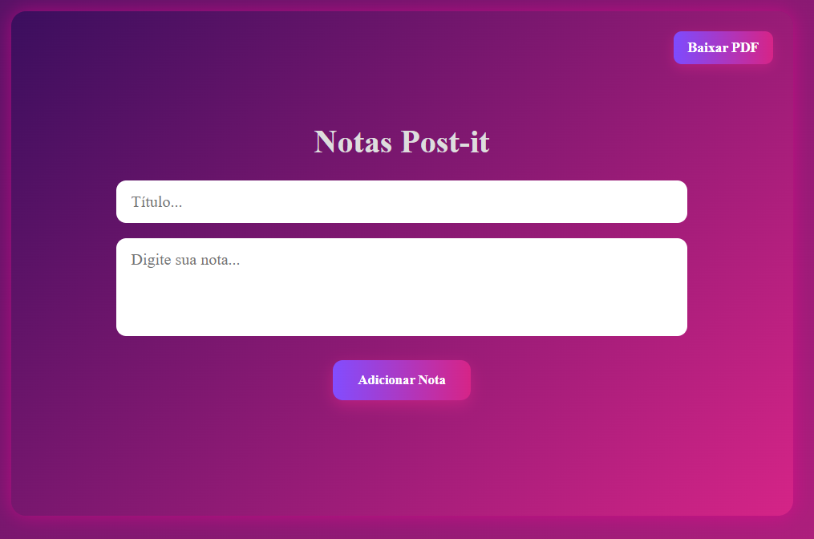

# Notas Post-it

O usuário pode adicionar, excluir e baixar notas em formato PDF. Possui um layout moderno e colorido.

## Tecnologias Usadas

 **React**: Biblioteca JavaScript para criar interfaces de usuário.
 **jsPDF**: Biblioteca para gerar arquivos PDF diretamente no navegador.
 **CSS Flexbox e Grid**: Para posicionamento responsivo e estilização do layout.

## O que pode ser feito no Notas Post-it

 **Adicionar Notas**: O usuário pode adicionar um título e conteúdo para a nota.
 **Excluir Notas**: O usuário pode excluir notas individualmente.
 **Baixar PDF**: O usuário pode baixar as notas em formato PDF.
